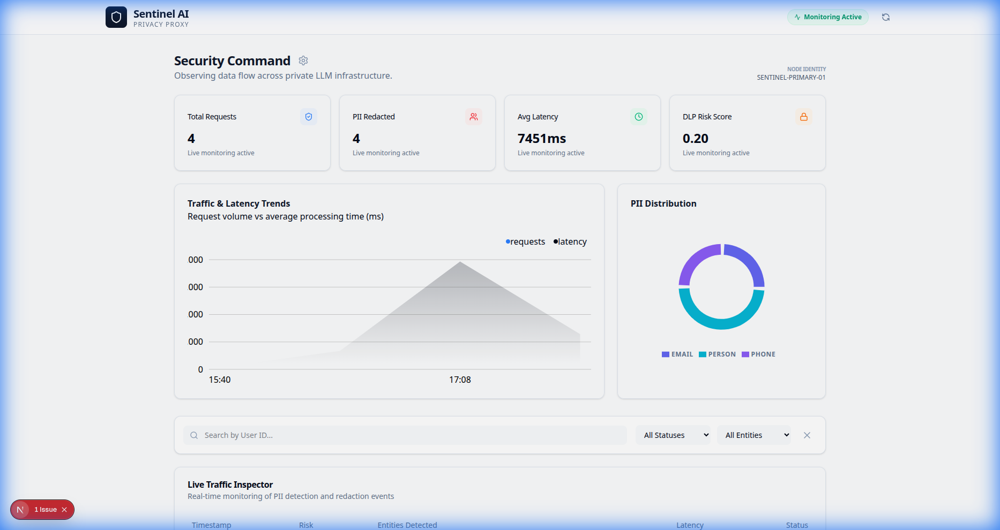
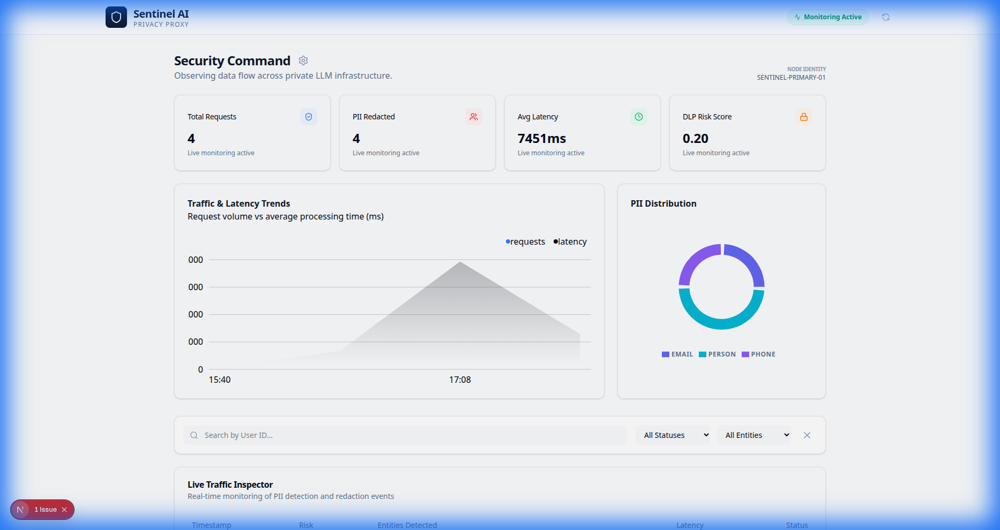
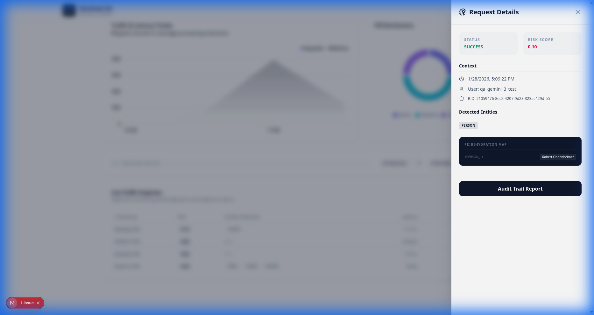

# Sentinel AI Privacy Proxy 🛡️

**Protect your sensitive data. Observe your AI interactions.**

Sentinel AI Privacy Proxy is a high-performance "Man-in-the-Middle" security layer designed to intercept, redact, and rehydrate PII (Sensitive Personal Information) in LLM conversations. It ensures that sensitive data like names, emails, and phone numbers never reach your AI provider while remaining invisible to the end-user.



## ✨ Key Features

- **Precision Redacted Multi-Model Support**: Support for OpenAI and Google Gemini (Gemini 2.5 Pro/Flash, Gemini 3 Pro/Flash).
- **Automated PII Redaction**: Uses Microsoft Presidio to detect and mask sensitive entities in real-time.
- **Bi-directional Rehydration**: Automatically restores redacted information in LLM responses before they reach the user.
- **OpenAI Compatible**: Drop-in replacement for OpenAI's `/v1/chat/completions` API.
- **Active Control Center (v2)**: Advanced security dashboard with interactive drill-downs, analytics trends, and policy configuration.
- **Postgres Persistence**: Securely logs redaction events and audit data for CISO-level observability.

## 🚀 Quick Start

### Prerequisites
- Docker & Docker Compose
- OpenAI API Key or Google API Key (Optional, defaults to Mock Mode)

### Run with Docker
```bash
# Clone the repository
git clone <repo-url>
cd ai-privacy-proxy

# 1. Configure Environment
cp .env.example .env
# Edit .env with your keys (OpenAI, Google Gemini)

# 2. Start the stack
docker compose up -d --build

# 3. Verify Health
curl http://localhost:8000/health
```

The services will be available at:
- **Dashboard**: [http://localhost:3000](http://localhost:3000)
- **Proxy API**: [http://localhost:8000](http://localhost:8000)
- **API Docs**: [http://localhost:8000/docs](http://localhost:8000/docs)

### ✨ Dashboard v2 Views

| **Main Analytics** | **Deep Inspection (Reveal)** |
|:---:|:---:|
|  |  |

## 🛠️ Usage Example

### OpenAI Client
```python
import openai

client = openai.OpenAI(
    base_url="http://localhost:8000/v1", 
    api_key="your-key-here"
)

response = client.chat.completions.create(
    model="gpt-3.5-turbo",
    messages=[{"role": "user", "content": "My name is Shubham Mathur and my phone is 9876543210."}]
)

print(response.choices[0].message.content)
# Output: "I understand. I have noted the details for Shubham Mathur." 
# (The LLM only saw <PERSON_1> and <PHONE_NUMBER_1>)
```

### Google Gemini Client
Simply change the model name to use Gemini models:
```python
response = client.chat.completions.create(
    model="gemini-1.5-flash", # Also supports gemini-2.5-pro, gemini-3-flash, etc.
    messages=[{"role": "user", "content": "My email is test@example.com"}]
)
```

## 📊 Observability & Control (v2)

The built-in dashboard provides an **Active Control Center** for privacy auditing:
- **Security Analytics**: Traffic & Latency Trends (Area Chart) and PII Distribution (Donut Chart).
- **Live Traffic Inspector**: Advanced filtering by User ID, Status, or Entity Type.
- **Request Drill-Down**: Slide-over details for every request with metadata and redacted context.
- **Policy Configuration**: Real-time management of risk thresholds and active PII detectors.

---
Built with ❤️ for AI Security.
